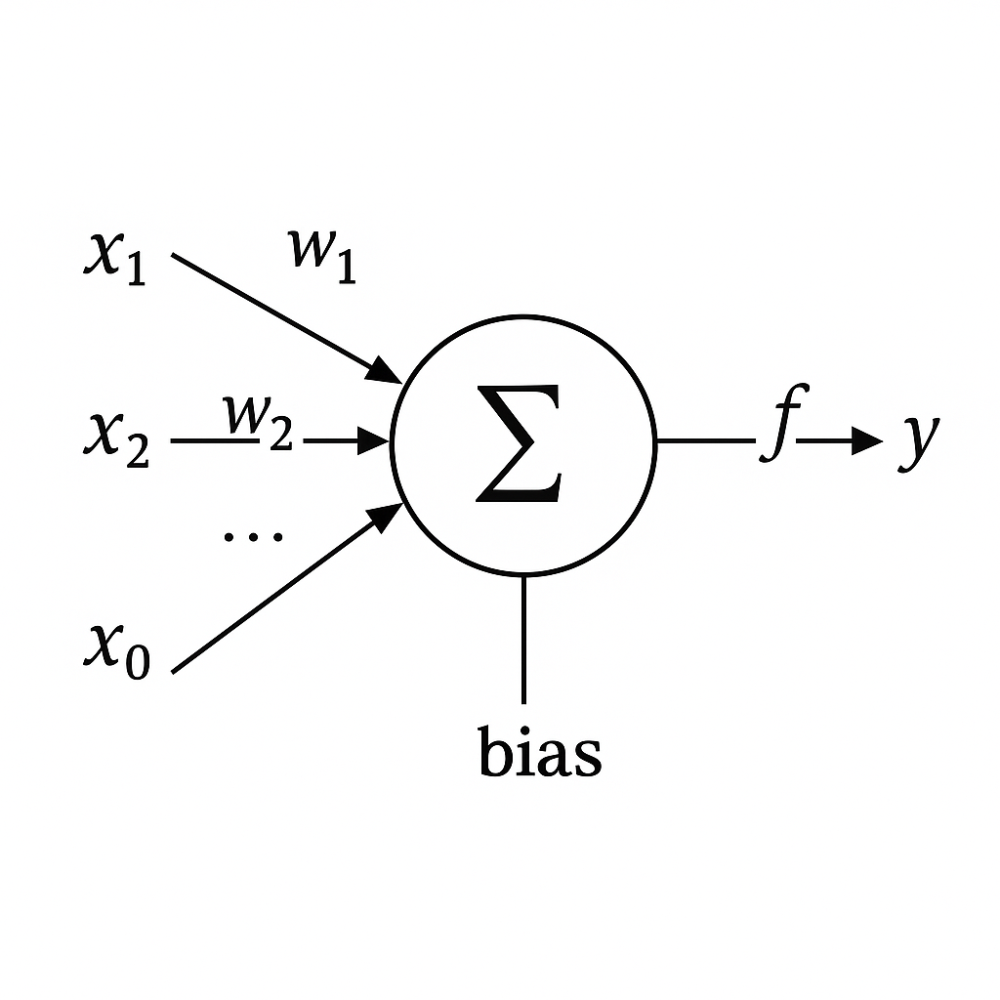

<h1 align="center"> Perceptron AND e Perceptron OR </h1>

# 🧠 Perceptron - Implementação para operações lógicas AND e OR

Este projeto apresenta uma implementação simples e didática do algoritmo **Perceptron**, escrita em **Python puro**, sem o uso de bibliotecas externas de machine learning. O objetivo é demonstrar, na prática, como funciona o treinamento de um perceptron para resolver operações lógicas básicas: **AND** e **OR**.

---

## 📚 Sobre o Perceptron

O **Perceptron** foi proposto por Frank Rosenblatt em 1958 e é considerado um dos primeiros algoritmos de aprendizado supervisionado. Ele é capaz de aprender funções lineares separáveis, como as operações lógicas **AND** e **OR**.

> O perceptron é a base das redes neurais artificiais modernas e do aprendizado de máquina.

<p align="center">
  
</p>
---

## 🔧 Funcionamento

O algoritmo segue os seguintes passos:

1. Inicializa os pesos com valores pequenos (ou zeros).
2. Calcula a saída com base nos pesos e nas entradas.
3. Compara com a saída esperada.
4. Atualiza os pesos caso a saída esteja incorreta.
5. Repete o processo até convergir (ou atingir o número máximo de épocas).

---

## 🧪 Exemplos

### 🟢 Operação OR

Entradas e saídas esperadas:
```
[0, 0] => 0  
[0, 1] => 1  
[1, 0] => 1  
[1, 1] => 1
```

### 🔴 Operação AND

Entradas e saídas esperadas:
```
[0, 0] => 0  
[0, 1] => 0  
[1, 0] => 0  
[1, 1] => 1
```

---

## ▶️ Como executar

Para executar há algumas maneiras,aqui vou falar duas delas:

1)Acessar o [código](https://github.com/R1chardJr/Perceptron-AND---OR/blob/main/Perceptron_2_variable_Handcrafted.ipynb), entra no Google Colab e
e criar uma cópia do projeto e executar - Dessa forma pode rodar em qualquer computador mesmo sem nada instalado

2)
```bash
git clone https://github.com/R1chardJr/Perceptron-AND---OR.git
```
e entao acessa o arquivo Perceptron_2_variable_Handcrafted e executa ele

## ✨ Resultados

Durante o treinamento, o console exibirá os ajustes dos pesos e a saída do perceptron a cada época, até que ele aprenda corretamente a operação lógica desejada.

---

## 🧠 Aprendizado

Este projeto foi criado com o objetivo de **reforçar os conceitos teóricos do Perceptron** e demonstrar de forma simples como um algoritmo de aprendizado supervisionado pode resolver problemas básicos de classificação.

---

## 📎 Referências

- Rosenblatt, F. (1958). The Perceptron: A Probabilistic Model for Information Storage and Organization in the Brain.
- McCulloch & Pitts (1943). A Logical Calculus of the Ideas Immanent in Nervous Activity.

---

## 🚀 Autor

Desenvolvido por [Richard Jr.](https://github.com/R1chardJr)  
🔗 GitHub: [@R1chardJr](https://github.com/R1chardJr)

---

## 📌 Licença

Este projeto está sob a licença MIT. Veja o arquivo [LICENSE](LICENSE) para mais detalhes.